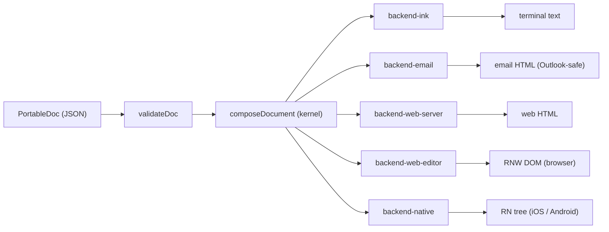

# portable-doc

**One semantic document → deterministic, beautiful output across Web, Native, Email, TUI, and plain text.**

[](https://github.com/FRIKKern/portable-doc/actions/workflows/ci.yml)
[](./LICENSE)

PortableDoc is a JSON document format, a compiler, an MCP server, and an editor. Author once against a closed AST of 10 block types; render natively across five surfaces with cross-surface guarantees enforced by the validator at edit time. Inspired by Tamagui, Sanity Portable Text, React Email, and Ink.

## Why

- **Closed by design.** 10 block types, intersection-schema validator. If a property doesn't survive on the most-compromised surface (Email or 80-col TUI), it's rejected at edit time — not papered over per surface.
- **One kernel, four backends.** `composeDocument(doc) → PdNode` builds a backend-agnostic primitive tree; thin adapters (Ink, Email, Web-server, Web-editor, Native) translate. New block = one component. New surface = one adapter.
- **MCP-native.** A local MCP server exposes the compiler as resources and tools; agents and assistants can validate, render, and rewrite documents over stdio.

## Architecture



## Quick start

```bash
pnpm install
pnpm test                              # 272 specs across 15 files
pnpm --filter editor dev               # http://localhost:5173
pnpm --filter @portable-doc/mcp-server start   # stdio MCP server
pnpm visual-goldens                    # writes goldens/{welcome,incident}-{tui,email,web,text}.{txt,html}
```

**Requires:** Node ≥ 20, pnpm ≥ 9.

## The editor

A Vite + React app with five preview tabs over the same document tree. The block list sits left, the edit form center, the validation panel along the bottom. Inactive tabs lazy-mount so the RNW preview never costs you anything until you open it. Two fixtures load on boot: `welcome` (onboarding) and `incident` (alert).

Tab order:

1. TUI (default)
2. Email
3. Web
4. Native
5. JSON

## The MCP server

Exposes the compiler over stdio. Five resources, four tools.

**Resources:**

- `portable-doc://schema/v1`
- `portable-doc://surface-contracts`
- `portable-doc://tokens/default`
- `portable-doc://examples/welcome`
- `portable-doc://examples/incident`

**Tools:**

- `doc_validate`
- `doc_render`
- `doc_explain_block`
- `doc_suggest_fixes`

`doc_render({ surface: "web" })` uses the slim hand-written `backend-web-server`, not RNW — the editor's RNW preview is browser-only.

## Block set

Ten block types:

- `heading`
- `paragraph`
- `list`
- `callout`
- `action`
- `section`
- `divider`
- `code`
- `image` — escape-hatch (`surfaces: ['web','native']`); renders as alt text on TUI and a placeholder on email
- `table` — escape-hatch (`surfaces: ['web','native']`); same fallback behavior

## Validator rules

Three rule classes:

- **Prop allowlist.** Reject `borderRadius`, `opacity`, `boxShadow`, `transform`, `animation`, `gradient`, `flex`, `flexWrap`, `justifyContent: 'space-between'`, `alignSelf`. Allow only the intersection-safe shape.
- **Content constraints.** `code` lines ≤ 60 cols; `tone` ∈ `{success, warning, danger, info, neutral}`; non-empty unique block ids; length limits on heading text and action labels.
- **URL safety.** Scheme allowlist: `http | https | mailto | tel`. Defense-in-depth at validate, kernel, and HTML-emitting backends.

## Monorepo layout

```
packages/
  core/                 AST + tokens + validateDoc
  primitives/           Pd* shape + composeDocument kernel
  pd-to-rn-shim/        Pd → RN-shaped data translation
  backend-ink/          terminal text adapter
  backend-email/        React Email adapter (Outlook VML, dark mode, a11y)
  backend-web-server/   hand-written HTML adapter (used by MCP)
  backend-web-editor/   react-native-web wrapper (editor preview only)
  backend-native/       react-native re-export through the shim
  mcp-server/           MCP server: 5 resources + 4 tools
apps/
  editor/               Vite + React editor (5 preview tabs, TUI default)
fixtures/               welcome + incident reference docs
scripts/visual-goldens.ts  emit per-fixture per-surface artifact files
```

## Testing

Three layers:

| Layer                                                                | Frequency         | Command                                       |
| -------------------------------------------------------------------- | ----------------- | --------------------------------------------- |
| Structural snapshots (kernel primitive-tree + Ink + Email + RE HTML) | every commit (CI) | `pnpm test`                                   |
| Per-adapter unit specs (escaping, allowlist, determinism, …)         | every commit (CI) | `pnpm test`                                   |
| Visual goldens (Ink TUI, Email HTML, Web HTML)                       | on demand         | `pnpm visual-goldens` then eyeball `goldens/` |

272 specs across 15 files at the time of release. CI also runs `pnpm typecheck` (per-package `tsc --noEmit`); `pnpm snapshots:ci` runs the structural snapshot suite and is wired into `.github/workflows/ci.yml`. Web-editor (RNW) and Native (RN) adapter snapshots are deferred — they inherit from the kernel + adapter layers.

## Status

**v0.2.0 — Sweet-Spot Architecture.** v0.1 shipped the foundation; v0.2 layers the cross-surface component kit on top. New: `@portable-doc/variants` with 21 named variants across 4 block catalogs (callout 5×2, action 2×2, section 3, code 2×2); a 4th validator rule class (`variant-allowlist`); `backend-ink` v0.2 with truecolor + Lipgloss-equivalent borders + cli-highlight syntax-coloring + iTerm2 inline images; editor variant UI with per-axis dropdowns and live swatch preview; sweet-spot reframing in the architecture spec.

272 specs across 15 files pass. Deferred to v0.3: utility-shorthand bridge (Tailwind-style `className` desugar), premium editor (Notion/Linear-style authoring), playground site, theme contexts.

**v0.1.0** — first release. The architecture is locked: validator, kernel, all five backends, the MCP server, and the editor ship working.

## Inspirations

- **Sanity Portable Text** — JSON document tree decoupled from rendering.
- **React Email** — email-client-safe component primitives.
- **Ink** — finite, named primitives for terminal output.
- **Tamagui** — token-driven, surface-aware rendering.

## License

MIT — see [LICENSE](./LICENSE).

---

Author: Frikk Jarl · 2026.
