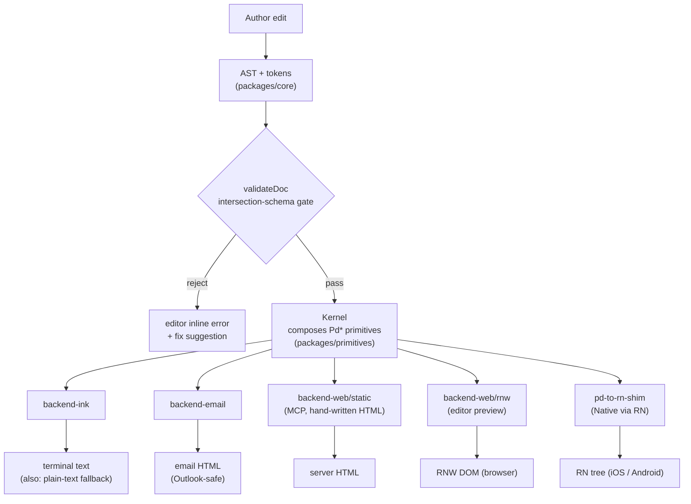
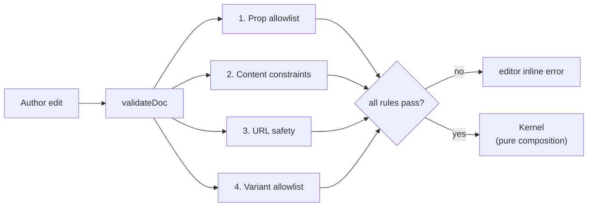
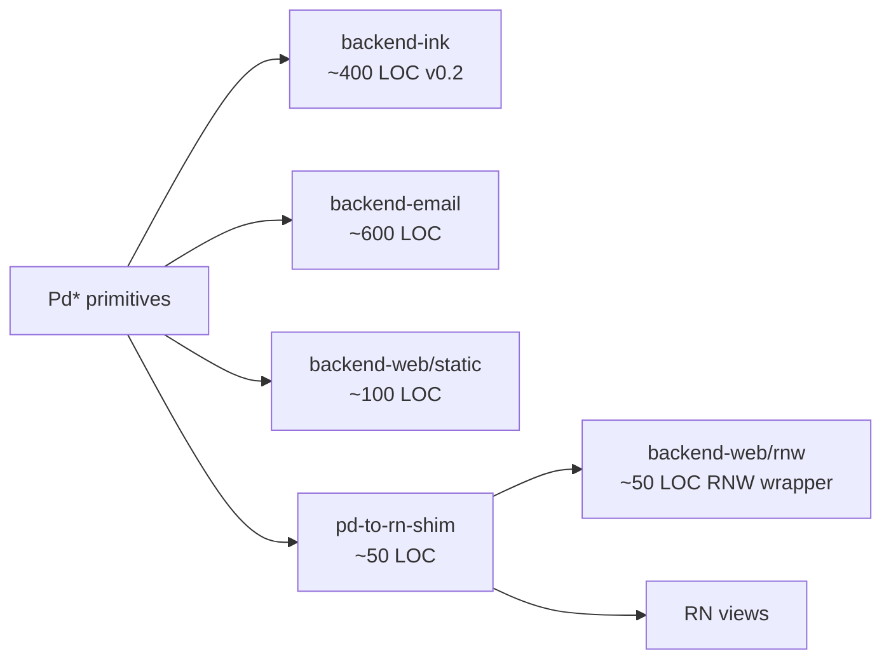
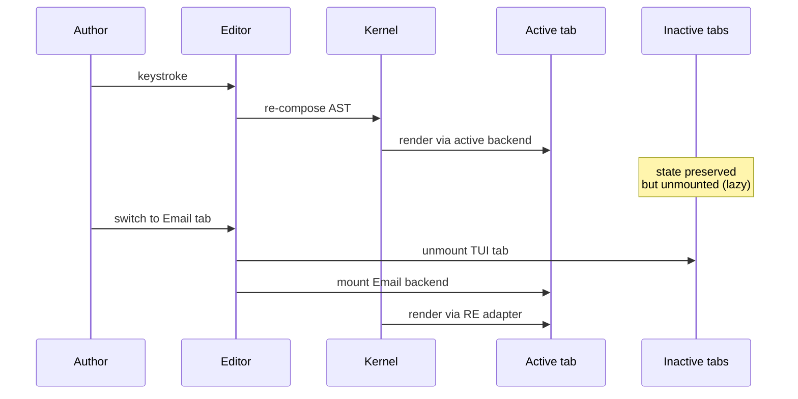
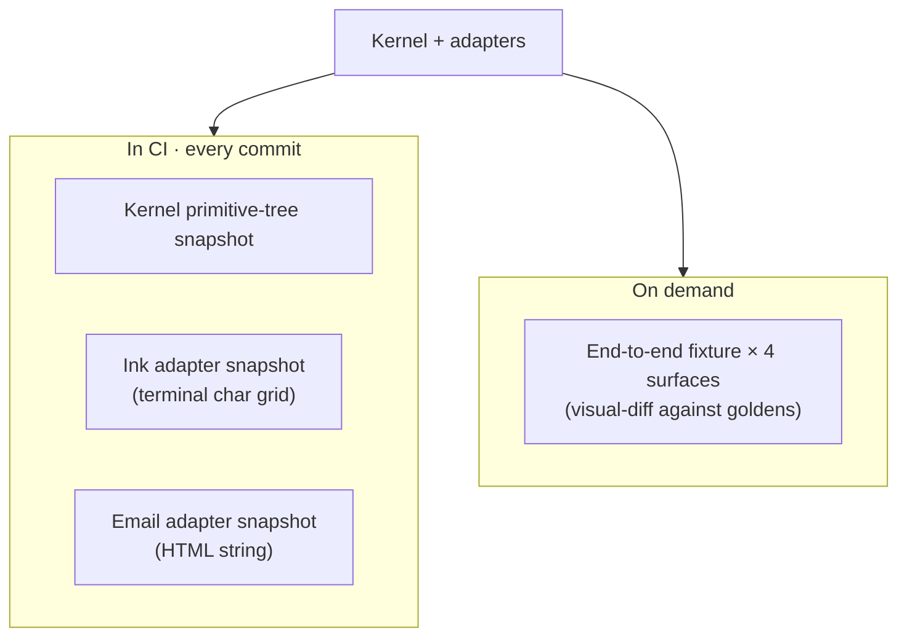

# Architecture

> One semantic document → deterministic, beautiful output across Web, Native,
> Email, TUI, and plain text.

This is the technical spec. For the *why* — convex-hull thinking, the
two-question test, the variant catalog rationale — read
[`design-philosophy.md`](./design-philosophy.md).

## The architectural shape

Five layers. The validator is the gate between author edits and the rest of
the pipeline. The kernel is pure composition. The backends are thin adapters
that translate Pd\* primitives into target output.



## Package layout

After the v0.2.1 collapses, the workspace ships eight packages plus the
editor app:

```
packages/
  core/              AST + tokens + validateDoc
  primitives/        Pd* shape + composeDocument kernel
  variants/          Variant catalog (21 variants × 4 block types)
  pd-to-rn-shim/     Pd → RN translation; doubles as Native re-export
  backend-ink/       Terminal text adapter (truecolor + degradation)
  backend-email/     React Email adapter (Outlook VML, dark mode, a11y)
  backend-web/       Web adapter
                       static/ — hand-written HTML for MCP server
                       rnw/    — react-native-web wrapper for editor
  mcp-server/        MCP server: 5 resources + 4 tools
apps/
  editor/            Vite + React editor (5 preview tabs, TUI default)
examples/            welcome.json + incident.json reference docs
goldens/             Per-fixture per-surface artifact files
scripts/
  visual-goldens.ts  Emit per-fixture per-surface artifacts
```

The earlier split between `backend-web-server` and `backend-web-editor` is
now subpath exports of a single `@portable-doc/backend-web` package
(`/static` and `/rnw`). `backend-native` is inlined into `pd-to-rn-shim` —
the shim is the Native surface.

## The AST

A PortableDoc is a JSON tree of typed blocks. The discriminator is `type`
(a TypeScript discriminated union). Every block has a stable `id` for edit
identity. Inline content is an `InlineNode[]` tree with marks (`text`,
`strong`, `em`, `code`, `link`).

### Block types

Ten core block types:

| Type | Notes |
|---|---|
| `heading` | Levels 1–3; max 80 chars |
| `paragraph` | Inline content tree |
| `list` | Ordered or unordered; items are `InlineNode[][]` |
| `callout` | `tone` ∈ `{success, warning, danger, info, neutral}` |
| `action` | Primary or secondary; `href` validated for safety |
| `section` | Replaces `card`; titled grouping with optional density variant |
| `divider` | Full-width rule |
| `code` | Optional `lang`; lines ≤ 60 cols |
| `image` | Escape-hatch with `surfaces: ['web','native']` (extends to TUI in v0.2.1.A); falls back to alt-text |
| `table` | Escape-hatch with `surfaces: ['web','native']`; rows-as-lines fallback |

Out of the AST entirely: `video`, `iframe`, `mathjax`, `chart`. Not
rejected — simply not nameable. The format does not promise these.

### Inline marks

`text`, `strong`, `em`, `code`, `link`. Links are tree nodes with `href`
on the node (not Portable Text-style markDefs indirection).

### Tokens

| Token | Values |
|---|---|
| `color` | Hex strings only |
| `tone` palette | `success`, `warning`, `danger`, `info`, `neutral` — five 16-color-safe pairs |
| `space` | `xs (4) | sm (8) | md (16) | lg (24) | xl (32)` |
| `borderStyle` | `single | double | bold` (`round` dropped — Outlook strips) |
| `typography` | System font stacks only |

Dropped at the kernel: `radius`, `shadow`, `opacity`, `gradient`,
`animation`, `transform`, `mediaQuery`, custom widths beyond fixed px.

## The validator (the load-bearing piece)

Intersection-schema validation is what turns "no sugar" from author
discipline into a property of the format. The validator runs four rule
classes; any failure produces an inline editor error before the kernel
sees the doc.



### Rule 1: prop allowlist

Only intersection-safe Pd\* props pass.

| Allowed | Rejected |
|---|---|
| `flexDirection: row | column` | `flex` (use fixed widths) |
| Fixed `width` (px) | `flexWrap` |
| `padding`, `margin` (px) | `justifyContent: space-between` |
| `borderWidth`, `borderColor` | `alignSelf` |
| `borderStyle: single | double | bold` | `borderRadius` |
| `backgroundColor` (hex only) | `opacity`, `boxShadow` |
| `verticalAlign: top | middle | bottom` | `transform`, `animation`, gradient |

### Rule 2: content constraints

- `code` blocks: lines max **60 cols** (TUI-driven, with margin). Reject
  longer lines at edit time; the author refactors before render.
- `tone` palette: five named tones only.
- List items: max length 200 chars.
- Headings: max length 80 chars.
- Block ids: non-empty, unique within the document.

### Rule 3: URL safety

Scheme allowlist `http | https | mailto | tel`. Anything else (e.g.
`javascript:`, `data:`, `file:`) rejected at edit time. Defense-in-depth:
kernel re-sanitizes; HTML-emitting backends re-escape on emit. Three
layers, no single point of failure.

### Rule 4: variant allowlist (v0.2)

Reject unknown variant axes, unknown values on a known axis, and any
variant on a no-catalog block. The `@portable-doc/variants` package owns
the `VARIANT_CATALOG` map; the rule consults it at validate-time.

## The kernel

`composeDocument(doc) → PdNode` is a pure, deterministic composer. Same
input → same primitive tree, every time. The kernel is ~150 LOC. It
re-sanitizes URLs (Rule 3 defense-in-depth) and is the single place where
variants resolve to fully-specified `PdStyle` objects (via the variant
catalog).

The Pd\* primitive set is paperflow-owned, shaped like React Native's
primitives:

- `<PdBox>` — flex container with padding, margin, border, background
- `<PdText>` — typed text with marks
- `<PdHr>` — horizontal rule
- `<PdLink>` — anchored inline content
- `<PdButton>` — call-to-action wrapper
- `<PdContainer>` — top-level document boundary

Pd\* is forked from RN at a snapshot, not re-exported. The
`pd-to-rn-shim` package translates Pd\* to RN at the Native and Web
backend boundary.

## Backends

Five rendering targets.



### `backend-ink` — terminal

Primary text-emitting backend. Powers the TUI surface and (in mono mode)
the plain-text fallback. v0.2 upgrade brought truecolor (`supports-color`
detects 24-bit → 256 → 16 → mono), Lipgloss-equivalent border styles,
`cli-highlight` for syntax-colored code blocks, and `terminal-image` for
inline images via Kitty / iTerm2 protocols. v0.2.1 adds the
`resolveColor(hex, depth)` interface to centralize degradation.

Plain-text mode: `renderInk(node, { colorDepth: 'mono', hyperlinks: false })`
walks the same Pd-tree and emits structural prose with no ANSI.

### `backend-email` — Outlook-safe HTML

The largest backend. ~600 LOC budget covers an inline-style serializer,
ten-block mappings, Outlook VML for buttons, MSO conditional spacing,
dark-mode override `<meta>` + `<style>`, and a11y attributes (`role`,
`alt`, `aria-label`).

### `backend-web/static` — hand-written HTML

Used by the MCP server's `doc_render({ surface: 'web' })`. ~100 LOC,
no React-Native-Web dependency, no JSX. Cold-start stays slim. Output is
a string of HTML with inline styles.

### `backend-web/rnw` — react-native-web

Used only by the editor's Web preview tab. ~50 LOC RNW wrapper. Loaded
lazily when the editor's Web tab activates. Never reaches the MCP server.

### `pd-to-rn-shim` — Native

The RN side. The shim is the Native backend; native React Native consumes
the shim's output directly. Shared with `backend-web/rnw`.

## The MCP server

A local MCP server exposes the compiler over stdio. Agents and assistants
can validate, render, and rewrite documents.

**Resources:**

- `portable-doc://schema/v1`
- `portable-doc://surface-contracts`
- `portable-doc://tokens/default`
- `portable-doc://examples/welcome`
- `portable-doc://examples/incident`

**Tools:**

- `doc_validate` — runs the four-rule validator
- `doc_render(doc, surface)` — renders to ink / email / web / native /
  text. `surface: 'web'` uses `backend-web/static`, never RNW.
- `doc_explain_block` — prose explanation of a block's contract
- `doc_suggest_fixes` — repair hints for common rejection patterns

## The editor

A Vite + React app with five preview tabs over the same document tree.
Block list left, edit form center, validation panel along the bottom.
Inactive tabs lazy-mount so the RNW preview never costs anything until
opened. Two fixtures load on boot: `welcome` and `incident`.

Tab order:

1. **TUI** (default — see the constraint surface first)
2. Email
3. Web
4. Native
5. JSON

Backend dispatch happens via React context: a `<BackendProvider
value={inkBackend}>` wraps each preview region. Editor controls (block
list, validation panel, JSON tab) stay plain React — they're not document
content, so RN-shape doesn't apply.



One keystroke produces one re-render of one preview region. Tab switch
incurs a remount, accepted.

## Test harness

Three layers, two cadences:

| Layer | Frequency | Command |
|---|---|---|
| Structural snapshots (kernel primitive-tree + Ink + Email + RE HTML) | Every commit (CI) | `pnpm test` |
| Per-adapter unit specs (escaping, allowlist, determinism, …) | Every commit (CI) | `pnpm test` |
| Visual goldens (Ink TUI, Email HTML, Web HTML) | On demand | `pnpm visual-goldens` then eyeball `goldens/` |

282 specs across 15 files at the time of v0.2.1. CI also runs `pnpm
typecheck` (per-package `tsc --noEmit`); `pnpm snapshots:ci` runs the
structural snapshot suite. Web-editor (RNW) and Native (RN) adapter
snapshots inherit from the kernel + adapter layers and are not
separately maintained.



## Sweet-Spot Reframing (v0.2)

v0.1 shipped under "intersection schema" framing — design the AST inside
the email + 80-col TUI intersection so every surface renders natively.
v0.2 sharpens the picture. **There is no single floor.** Plain text is
the most-limited surface (a universal degradation target), and email is
far more constrained than TUI in the rich-rendering axes that matter —
truecolor, layout, hyperlinks, inline images. The "intersection" framing
was directionally correct but linear; the v0.2 frame is a **convex hull**
of features every surface can deliver at top UX.

Read [`design-philosophy.md`](./design-philosophy.md) for the convex-hull
walkthrough and the two-question test.

### What v0.2 added

- `@portable-doc/variants` — `VARIANT_CATALOG` map for callout (5×2 = 10
  variants), action (2×2 = 4), section (3 density values), code (2×2 = 4)
  — 21 named variants total.
- 4th validator rule class — `variant-allowlist` rejects unknown axes,
  unknown values, or any variant on a no-catalog block.
- `backend-ink` v0.2 with truecolor + Lipgloss-style borders +
  cli-highlight syntax-coloring + iTerm2 inline images.
- Editor variant UI — per-axis dropdowns plus a swatch preview in
  `BlockForm.tsx`.

### Per-feature degradation

Plain text isn't a feature set we constrain the AST to. It's where the
AST renders *down to* via a dedicated rendering strategy — today,
`renderInk(node, { colorDepth: 'mono', hyperlinks: false })` walks the
same Pd-tree and emits structural prose with no ANSI. Every surface above
plain text inherits this fallback automatically when richer capabilities
aren't available.

| Capability | Detection | Degradation |
|---|---|---|
| Truecolor | `supports-color` | 24-bit → 256 → 16 → mono |
| Hyperlinks | OSC-8 support | bare URL after label |
| Inline images | `terminal-image` | Kitty → iTerm2 → ANSI half-block → `[image: alt]` |
| Border styles | Surface support | `single` (rounded in Ink) → ASCII fallback |

### What v0.2 deliberately deferred

- **Separate `backend-text` package** — would emit Markdown-style `#`
  heading, `[DANGER] body`, `Label (https://...)`. Moves boundaries, not
  output quality. v0.1's `renderInk(mono)` produces acceptable plain-text
  output. If Markdown-pure text matters later, a `mode: 'text'` flag
  inside `backend-ink` (~30 LOC) would land it without a new package.
- **MCP text-surface reroute** — depended on `backend-text`; drops with
  it.
- **Utility-shorthand bridge** — Tailwind-style `className` desugar at
  the editor. Removed from the roadmap entirely. The variant catalog
  plus typed token objects are paperflow's utility surface.

## Non-goals

Carried forward from v0.1, unchanged:

- Auth, DB, cloud sync.
- Real email send.
- Full WYSIWYG, drag-drop editor.
- Full Expo native runtime.
- `video`, `iframe`, `mathjax`, `chart` blocks.

## Bottom line

AST = strict intersection (closed by design). Validator = the gate (four
rule classes). Kernel = composition only (~150 LOC). Five backends ≈ 900
LOC total. Editor = lazy-mount per tab. Test harness = structural in CI,
visual on demand. The architecture is locked.

For the *why*, see [`design-philosophy.md`](./design-philosophy.md).
For how to contribute, see [`../CONTRIBUTING.md`](../CONTRIBUTING.md).
