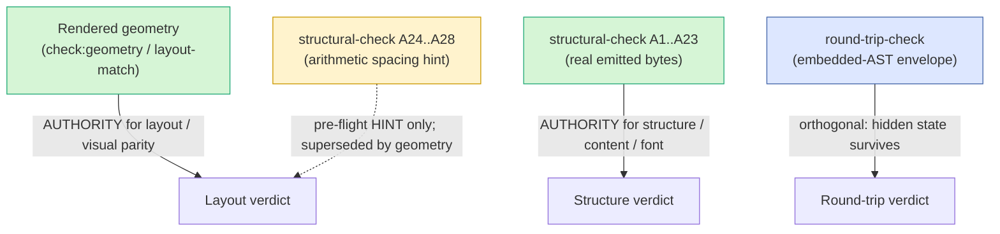

# Parity trust boundary

This is the authority hierarchy for parity verification in Papir. When two
checks disagree about whether an export "matches" the editor, this document
says which one wins. Read it before adding a new gate, loosening a threshold,
or quoting a green run as proof of visual fidelity.

The one-line version: **rendered geometry is the authority for layout;
structural-check is the authority for structure; arithmetic spacing is only a
hint.**

## The hierarchy

| Check | Authority over | How it decides | Gates CI? |
|---|---|---|---|
| Rendered geometry (`check:geometry`, layout-match) | **layout / visual parity** | exact glyph coordinates extracted from real PDFs, line-height-normalized relative delta, per-block verdicts | yes (full-gate tiers) |
| structural-check **A1..A23** | **structure / content / font** | boolean assertions over the real emitted bytes (DOCX OOXML, EPUB OPF, HTML, source CSS) | yes |
| structural-check **A24..A28** | nothing — a hint | arithmetic spacing math; estimates block positions from cumulative margins; renders nothing | no (advisory WARN) |
| round-trip-check | **embedded-AST envelope** | re-imports the exported file and diffs the recovered AST | yes (orthogonal) |

## Rendered geometry is the layout authority

`pnpm check:geometry` (`scripts/semantic-diff.ts` →
`scripts/lib/render-to-pdf.ts` → `pdf-geometry.ts` → `layout-match.ts`)
renders each export channel **and** the editor canvas to PDF, extracts the
exact glyph coordinates, segments them into blocks, and computes a per-block
verdict from the **relative inter-block delta** (the primary metric; absolute
drift is kept as a non-gating diagnostic). This is the only thing that
actually looks at where the pixels land, so it is the authority for any claim
about layout or visual fidelity.

Geometry thresholds (bound decision #8): pass `< 8.5pt`, warn `8.5–17pt`,
fail `> 17pt` (a fail blocks CI). DOCX uses a looser `> 1.5 line-heights` fail
under a `reflow-sanity` gate level. SSIM is a warn-only floor (~0.92) that
never blocks CI. All tolerances live in one constants file.

## structural-check A1..A23 own structure

A1..A23 verify the real emitted bytes — paragraph counts, heading sequences,
callout tone/emphasis classes, OOXML `<w:rFonts>` references, embedded font
binaries, EPUB OPF manifest entries, source-CSS `@font-face` shapes, magic
numbers. They are authoritative for **structure, content, and font** because
they inspect what was actually written to the file. A miss here hard-fails
the run (exit 1).

## A24..A28 are a pre-flight hint, not layout truth

A24..A27 are a **fast (<1s) arithmetic sanity hint**. They estimate each
block's cumulative position by summing CSS / OOXML margins — they never render
a glyph. A28 is a no-op stub kept only so the A-sequence stays whole; PDF
layout is now done for real by rendered geometry.

These are tagged `gateLevel: "preflight-estimate"` (A24..A27) and
`gateLevel: "deferred"` (A28). A miss prints **WARN**, never FAIL, and does
**not** change the exit code. They were superseded by rendered geometry the
moment T1–T3 landed.

> **Green on A24..A27 means "the spacing math agrees," NOT "the pixels
> agree."** Two channels can have identical margin arithmetic and still reflow
> differently once a real renderer wraps lines, collapses margins, or
> substitutes a font. Only `check:geometry` can confirm the pixels. Use the
> hint to catch gross arithmetic drift cheaply before paying for a render;
> never quote it as a layout verdict.

## round-trip-check is orthogonal

`pnpm check:roundtrip` proves the **embedded-AST envelope** survives a
write → read cycle: the hidden Portable-Doc state recovers byte-for-faithful
after export. It says nothing about the visible surface — a document can
round-trip perfectly and still lay out wrong, and vice versa. Treat it as a
separate axis from both geometry and structure.

## Channel gate tiers (bound decision #7)

Not every channel gets the full geometry gate. Each channel records a
`gateLevel`:

| Channel | Gate |
|---|---|
| editor | full geometry gate |
| HTML | full geometry gate |
| PDF | full geometry gate |
| DOCX | full geometry gate (looser `reflow-sanity` threshold) |
| EPUB | **structural-only** (order + presence); geometry informational |
| Markdown | **structural-only** (order + presence); geometry informational |

EPUB and Markdown reflow by design (reader-controlled font size, no fixed
page), so absolute geometry parity is not a meaningful target there — they are
gated on structure and presence, with geometry kept as an informational
diagnostic only.

## Caveat: LibreOffice ≠ Microsoft Word (bound decision #12)

The DOCX rendered-geometry leg uses LibreOffice (`soffice --convert-to pdf`)
as its oracle because **Microsoft Word has no Linux build** and CI runs on
Linux. The DOCX verdict therefore means *"lays out sanely / reflows as
expected,"* **not** *"pixel-identical to Word."* After conversion we assert
the embedded PDF font names are still the Source Serif 4 family and fail
loudly on substitution (decision #6), but the layout itself is judged against
LibreOffice's renderer, not Word's. Word-specific quirks are not regressions
against this oracle.

## Caveat: the editor leg must be the LIVE editor render

Every channel verdict is a comparison *against the editor*. For that
comparison to be authoritative, the editor PDF leg must be the **live editor
render** — the actual on-screen layout, not a re-derivation of it. Until that
wiring lands (tracked in **pdoc-4pz**), the editor reference is provisional,
and so are the channel verdicts that depend on it. Read green channel results
in that period as "consistent with the current editor approximation," not as
final visual parity.
