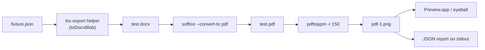

# Visual fidelity workflow

A tight loop for checking that Papir's editor render matches what users
actually get when they open the exported `.docx` in Word, Pages, or
Google Docs.

## What the pipeline does



The CLI is `bin/papir-visual-check`. It takes a Portable-Doc fixture JSON,
runs it through the same `toDocxBlob` the in-browser export uses, asks
LibreOffice (headless) to render that `.docx` to a PDF the way Word would,
and rasterizes page 1 to a 150 DPI PNG. The whole thing takes 2–4 seconds.

## One-time setup

```bash
brew install --cask libreoffice   # provides `soffice`
brew install poppler              # provides `pdftoppm`
# Optional:
brew install imagemagick          # enables the side-by-side composite step
```

LibreOffice gives you about 95 percent Word fidelity — close enough for
iterative work. For pixel-exact Word output (`Word.app` AppleScript
automation), see *Caveats* below.

## Usage

Manual, with the default fixture (`examples/welcome.json`):

```bash
bin/papir-visual-check
# or
pnpm visual-check
```

Manual with a specific fixture:

```bash
pnpm visual-check apps/editor/some-fixture.json
```

Agent-friendly (no `open`, just JSON to stdout):

```bash
bin/papir-visual-check examples/welcome.json --quiet | jq .
```

## JSON output shape

```json
{
  "ok": true,
  "fixture": "/abs/path/to/fixture.json",
  "work_dir": "/tmp/papir-visual-<ts>",
  "artifacts": {
    "docx": "/tmp/papir-visual-<ts>/test.docx",
    "pdf":  "/tmp/papir-visual-<ts>/test.pdf",
    "pdf_png": "/tmp/papir-visual-<ts>/pdf-1.png",
    "editor_png": null,
    "side_by_side_png": null,
    "diff_score": null
  },
  "tools_available": {
    "soffice": true,
    "pdftoppm": true,
    "imagemagick": false,
    "playwright": false
  },
  "elapsed_ms": 2480,
  "next_steps": ["…"]
}
```

The four `*_png` fields and `diff_score` are placeholders for the Phase 2
roadmap — agents can branch on `tools_available.playwright` later.

## The agent loop

1. Run `bin/papir-visual-check <fixture> --quiet | jq .`.
2. Read `artifacts.pdf_png`, inspect against the editor at
   `http://localhost:5173/` (or a Playwright screenshot — Phase 2).
3. Note the visual delta in plain words. Decide which side is wrong:
   the editor (paper.css) or the exporter (`apps/editor/src/export/toDocx.ts`).
4. Make the smallest change that closes the gap; re-run; repeat.
5. When it lands, commit and move to the next fixture.

## Multi-channel agent loop (`--all-channels`)

Phase 2 of this pipeline is live. One command renders all three output
channels plus the editor truth and pixel-diffs them in one shot:

```bash
pnpm visual-check --all-channels --quiet | jq .
```

Or, via the bash wrapper directly (no `pnpm run` preamble polluting
stdout — recommended for agent jq parsing):

```bash
bin/papir-visual-check --all-channels --quiet | jq .
```

What it does:

1. Serializes the fixture into `.docx`, `.pdf`, `.epub` in parallel.
2. Boots `vite preview` on port 5174 against `apps/editor/dist`
   (auto-runs `pnpm build` if `dist/` is missing).
3. Launches Playwright headless Chromium, navigates to the preview,
   screenshots `[data-testid="paper-column"]` — the truth PNG.
4. Renders each format to PNG:
   - `.docx` → `soffice --headless --convert-to pdf` → `pdftoppm`
   - `.pdf`  → `pdftoppm` (no LibreOffice — we already make real PDFs)
   - `.epub` → JSZip + epub.js inside the same headless Chrome,
     served from a tiny in-process static server
5. Normalizes all four PNGs to 820 px wide via `sharp` (top-anchored).
6. Pixel-diffs each format against the editor PNG via `pixelmatch`;
   partitions the diff PNG into 4 horizontal bands and reports the
   band with the most non-zero pixels as `worst_region`.
7. Composes a 4-up image (`Editor | Word | PDF | EPUB`) with a header
   strip, writes it to `<work-dir>/comparison-4up.png`.
8. Emits the JSON below to stdout; opens the composite in `Preview.app`
   unless `--quiet`.

### Multi-channel JSON output shape

```json
{
  "ok": true,
  "fixture": "/abs/path/welcome.json",
  "work_dir": "/tmp/papir-visual-<ts>",
  "editor_png": "/tmp/.../editor.png",
  "channels": {
    "docx": { "rendered_png": "...", "diff_png": "...",
              "diff_score": 0.048, "worst_region": "bottom quarter (footer / actions)" },
    "pdf":  { "rendered_png": "...", "diff_png": "...",
              "diff_score": 0.049, "worst_region": "..." },
    "epub": { "rendered_png": "...", "diff_png": "...",
              "diff_score": 0.057, "worst_region": "..." }
  },
  "composite_png": "/tmp/.../comparison-4up.png",
  "elapsed_ms_per_step": { "...": 100 },
  "elapsed_ms_total": 4800,
  "recommendation": "EPUB has highest diff (0.0570) ... — inspect apps/editor/src/export/toEpub.ts"
}
```

`diff_score` is the fraction of differing pixels (0..1, lower is better).
`worst_region` is a 4-band coarse hint — top quarter = "heading / first
paragraph", second = "callout / body", third = "list / divider", bottom
= "footer / actions". Heuristic; iterate the serializer that owns the
indicated band.

### One-time setup

The first run needs Playwright's Chromium build downloaded once
(~260 MB):

```bash
pnpm -F editor exec playwright install chromium
```

The orchestrator does NOT auto-install — if the browser is missing, it
errors with the exact command above and exits.

### Example agent prompt

> Read the JSON from `bin/papir-visual-check --all-channels --quiet`.
> Identify the channel with the highest `diff_score`. Open
> `composite_png` and the `diff_png` for that channel; correlate the
> visual delta with the `worst_region` hint. Edit the responsible
> serializer at `apps/editor/src/export/to{Docx,Pdf,Epub}.ts`. Re-run.

### Implementation

- Orchestrator: `apps/editor/scripts/visual-check.ts` (~420 LOC, tsx).
- Wrapper: `bin/papir-visual-check` delegates here when
  `--all-channels` is set; the docx-only legacy path is preserved when
  the flag is absent.
- Deps (in `apps/editor`): `playwright`, `pixelmatch`, `pngjs`, `sharp`.

### Caveats (multi-channel)

- Total wall-clock is ~5 s on a warm cache (Playwright launch dominates).
  Cold first run after `playwright install` adds ~2 s.
- Vite preview binds explicitly to `127.0.0.1` so the IPv4 fetch from
  Playwright + waitForPort hits the same socket.
- The EPUB render loads JSZip + epub.js from jsDelivr. Offline runs
  will fail at the `epub-render` step — vendor the two scripts into
  the workspace if that becomes a real constraint.
- CI gate (fail the build on score regression beyond a budget) is the
  obvious next step but is NOT wired in this commit. Manual loop only.

## Caveats

- **LibreOffice ≈ 95 % Word fidelity.** Most layout, typography, tables,
  and shading match Word's behavior closely. Subtle differences appear in
  hyphenation, narrow-column line-breaks, and a handful of OOXML edge
  cases (nested table cell shading, complex pBdr stacks). For decisions
  that hinge on the last 5 %, open the `.docx` in Word.app directly.
- **Microsoft Word automation** (`osascript -e 'tell app "Microsoft Word"
  ... export as PDF'`) is out of scope for v1. Needs a paid Word install
  and breaks on every Word update.
- **Fonts:** the exporter embeds **Source Serif 4** (all four weights as
  real font bytes via `Document({ fonts: [...] })`, writing `word/fonts/*.ttf`
  + `word/fontTable.xml` — see `apps/editor/src/export/toDocx.ts:67-191,961`),
  so the `.docx` renders the same prose face in Word / Pages / Google Docs /
  LibreOffice with no host font install required. Georgia is only the
  reader-fallback chain in `styles.xml`. No "ensure Georgia on the host" step
  is needed.
- **First-run latency:** the first `soffice --headless` invocation after
  a reboot can take 10+ seconds while LibreOffice spins up its profile.
  Subsequent runs are sub-second.
