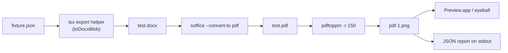

# Visual fidelity workflow

A tight loop for checking that Papir's editor render matches what users
actually get when they open the exported `.docx` in Word, Pages, or
Google Docs.

## What the pipeline does



The CLI is `bin/papir-visual-check`. It takes a Portable-Doc fixture JSON,
runs it through the same `toDocxBlob` the in-browser export uses, asks
LibreOffice (headless) to render that `.docx` to a PDF the way Word would,
and rasterizes page 1 to a 150 DPI PNG. The whole thing takes 2–4 seconds.

## One-time setup

```bash
brew install --cask libreoffice   # provides `soffice`
brew install poppler              # provides `pdftoppm`
# Optional:
brew install imagemagick          # enables the side-by-side composite step
```

LibreOffice gives you about 95 percent Word fidelity — close enough for
iterative work. For pixel-exact Word output (`Word.app` AppleScript
automation), see *Caveats* below.

## Usage

Manual, with the default fixture (`examples/welcome.json`):

```bash
bin/papir-visual-check
# or
pnpm visual-check
```

Manual with a specific fixture:

```bash
pnpm visual-check apps/editor/some-fixture.json
```

Agent-friendly (no `open`, just JSON to stdout):

```bash
bin/papir-visual-check examples/welcome.json --quiet | jq .
```

## JSON output shape

```json
{
  "ok": true,
  "fixture": "/abs/path/to/fixture.json",
  "work_dir": "/tmp/papir-visual-<ts>",
  "artifacts": {
    "docx": "/tmp/papir-visual-<ts>/test.docx",
    "pdf":  "/tmp/papir-visual-<ts>/test.pdf",
    "pdf_png": "/tmp/papir-visual-<ts>/pdf-1.png",
    "editor_png": null,
    "side_by_side_png": null,
    "diff_score": null
  },
  "tools_available": {
    "soffice": true,
    "pdftoppm": true,
    "imagemagick": false,
    "playwright": false
  },
  "elapsed_ms": 2480,
  "next_steps": ["…"]
}
```

The four `*_png` fields and `diff_score` are placeholders for the Phase 2
roadmap — agents can branch on `tools_available.playwright` later.

## The agent loop

1. Run `bin/papir-visual-check <fixture> --quiet | jq .`.
2. Read `artifacts.pdf_png`, inspect against the editor at
   `http://localhost:5173/` (or a Playwright screenshot — Phase 2).
3. Note the visual delta in plain words. Decide which side is wrong:
   the editor (paper.css) or the exporter (`apps/editor/src/export/toDocx.ts`).
4. Make the smallest change that closes the gap; re-run; repeat.
5. When it lands, commit and move to the next fixture.

## Phase 2 roadmap (not yet implemented)

- **Editor screenshot** — Playwright drives the dev server, navigates to
  the fixture, captures `apps/editor`'s rendered DOM at the same DPI as
  the PDF PNG. Lands in `artifacts.editor_png`.
- **Pixel diff** — `pixelmatch` (or ImageMagick `compare -metric AE`)
  produces a per-pixel delta image plus a normalized score; lands in
  `artifacts.side_by_side_png` and `artifacts.diff_score`.
- **CI gate** — hook the pipeline into `pnpm test` for a small set of
  golden fixtures, fail the build on score regressions beyond a budget.

Tools needed: `playwright`, `pixelmatch`, `pngjs`. Add as devDeps in a
follow-up task; do not pull them in for v1.

## Caveats

- **LibreOffice ≈ 95 % Word fidelity.** Most layout, typography, tables,
  and shading match Word's behavior closely. Subtle differences appear in
  hyphenation, narrow-column line-breaks, and a handful of OOXML edge
  cases (nested table cell shading, complex pBdr stacks). For decisions
  that hinge on the last 5 %, open the `.docx` in Word.app directly.
- **Microsoft Word automation** (`osascript -e 'tell app "Microsoft Word"
  ... export as PDF'`) is out of scope for v1. Needs a paid Word install
  and breaks on every Word update.
- **Fonts:** the exporter targets Georgia. LibreOffice substitutes if
  Georgia isn't installed locally, which changes metrics. Ensure Georgia
  is on the host before trusting the PNG.
- **First-run latency:** the first `soffice --headless` invocation after
  a reboot can take 10+ seconds while LibreOffice spins up its profile.
  Subsequent runs are sub-second.
